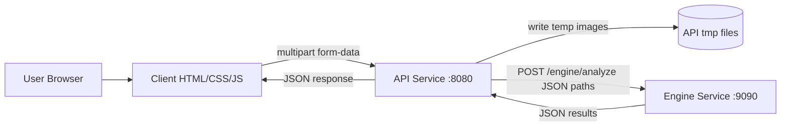

# Architecture (Current)

## Notes

- Client is static and calls API directly.
- API validates image files and request fields before calling Engine.
- Engine currently returns stub damage labels (not model-backed inference in C++ route yet).
